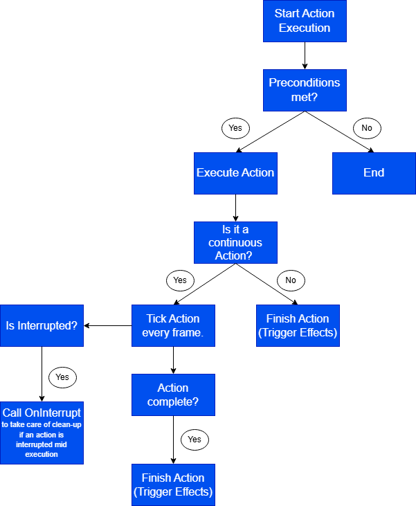

# GOAP (Goal Oriented Action Planning) plugin for Unreal Engine

## What is GOAP?

GOAP is an AI technique used to make game agents plan their actions dynamically based on goals and available conditions. Instead of pre-scripted behaviour like in Behaviour trees, a GOAP agent will decide its course of actions based on the world state it holds, what goals it wants to achieve and what actions the agent has. It will determine the best sequence of actions to reach those goals. This makes AI characters more flexible and adaptive, allowing them to respond intelligently to changing situations in the game world.

## Why this Plugin?

This plugin brings a GOAP framework to Unreal Engine, designed to be:
- Blueprint-friendly, it is easy assign actions, goals, and world states via Blueprints.
- Flexible, the plugin supports continuous actions like patrolling or interacting with objects.
- Debuggable: it includes logging levels and plan visualization.
- Self-contained, there are no external dependencies beyond Unreal Engine.
I created this plugin to add another way to control AI in unreal, which primarily uses Behaviour Trees due to its ease of use, but GOAP has a high flexibility and is best for complex and dynamic AI. I have also never worked with GOAP and wanted to learn more about different AI techniques and I think it is a valuable AI technique for portfolios.

## How It Works:

I will explain in sort what every aspect of the plugin does here, I also made documentation with Doxygen which also has class graphs, collaberation graphs, include graphs and included by graphs. I testes this plugin using Unreal's Third Person Template, and I made implementations of Actions and Goals with that in mind, some actions, lik patrolling, equip gun and kill enemy all have animations from the models from that template, if you want to use other animations you can swap them out or of course make your own implementations.
And here is my full [GOAP Plugin Documentation](https://annedegeus01.github.io/GOAPPlugin/index.html). The Goal and Action examples are not documented there but they are included in the source files.

### World State
Each agent has a UGOAPWorldStateComponent representing the current state of the world (e.g., “EnemyVisible = true”, “HasWeapon = false”). You can assign Agents states when you create them, but Agents can also receive new states as the program is running, they can get them from Action's effects. The UGOAPWorldStateComponent holds an instance of FGOAPWorldState (Which is in GOAPTypes.h), and that contains the key facts about the environment the agent is aware of. The facts are stored in a TMap<FName, bool>.
Here is tiny flow of what happens when a state changes:

### Actions
Actions define preconditions and effects:
- Preconditions: conditions that must be true to perform the action.
- Effects: changes to the world after the action executes.

### Goals
Goals define a desired world state that the agent wants to achieve. Each goal has a priority to influence planning, and a relevance to check if the goal should be considered, KillEnemy might have the highest priority but if there is no enemy it should not be selected. The plugin has dynamic goal selection based on this priority and relevance.

### Planner
The planner finds the lowest-cost sequence of actions that transforms the current world state into a state satisfying the chosen goal.
It uses a simple A* search over the state space, it works really well with GOAP’s Structure, since GOAP problems naturally map to a graph:
- Nodes are the world states.
- Edges are the actions with preconditions and effects.
A* is designed exactly for this kind of problem, a weighted graph where I want the least-cost path from one node, which will be the current state to another, which is the goal state.
Here is a diagram of how my plan function works:

### Agent
The AGOAPAgent class is the core of the GOAP system. It is responsible for managing the agent's current state, goals, actions, and interactions with the environment. It acts as the bridge between the world state, the planner, and the agent’s behavior in the game world.
Here is a behavior / sequence flow for the Agent:

And Agent planning & execution flow:

## How to use this plugin:
- Add the plugin to your Unreal project.
- Create an AGOAPAgent and attach a UGOAPWorldStateComponent.
- Define UGOAPAction subclasses with preconditions and effects.
- Define UGOAPGoal subclasses with desired world states and relevance.
- Assign actions and goals to the agent.
- Drop the agent in the level.
- Thats it!

The agent will have a World state component and options to add any States, Actions and Goals. From here you can also set the debug level, None, Minimal or Detailed. Set a reaction time, if you want any, this mostly helps with synchronized replanning. Here a visual of what the agent looks like in bluepints:

